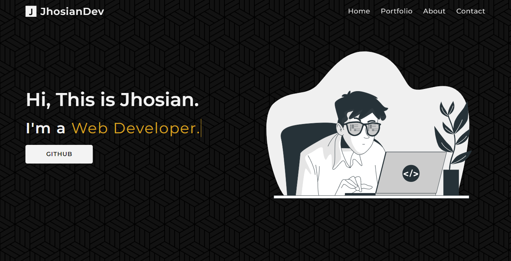
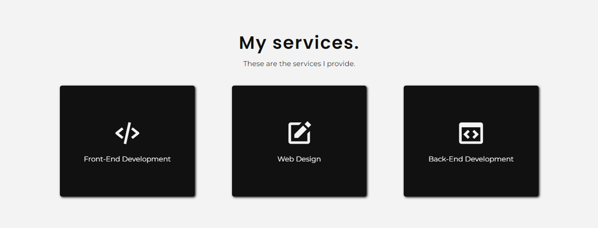

# Portfolio Front-End

## **This is my portfolio template:**

1. [Result](https://jhosiangtz.github.io/)

2. [UI/UX](images/UI/UI.pdf)

# Website Images

HomePage
 

Portfolio

About

Services

Contact

----------
# Mobile Screenshots

HomePage

 

Portfolio

About

Services

Contact

----------
# Resources 

1. [Icons: BoxIcons](https://boxicons.com/)

2. [Ilustration: StorySet ](https://storyset.com/)

